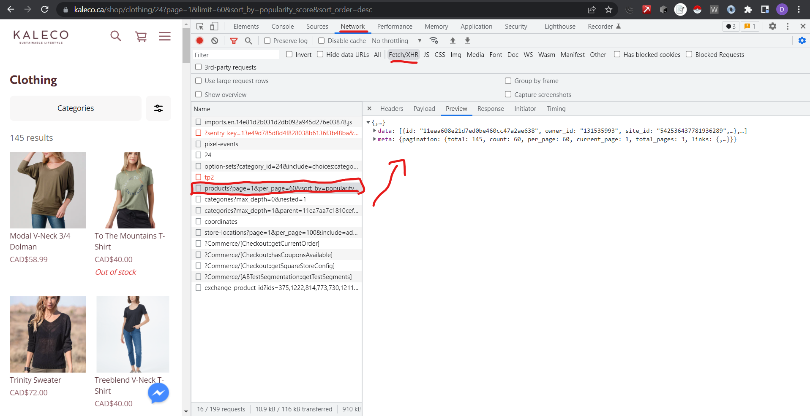
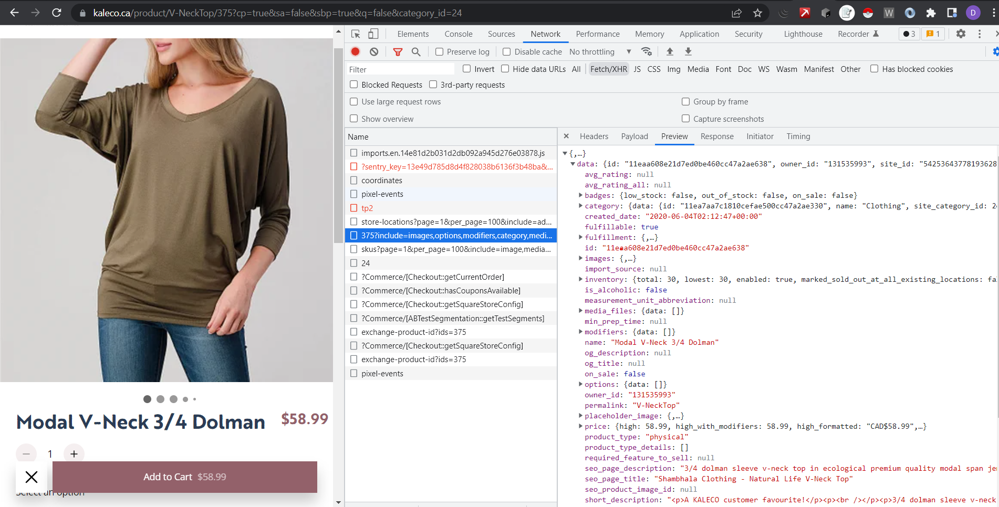
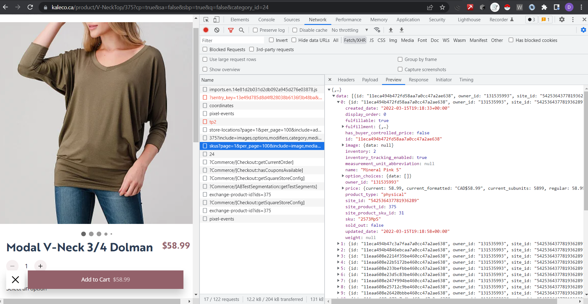

# Square and Weebly Scrapers Documentation 📖 v0.2

## Square:
- ~~Morgane~~ : https://morganekelowna.square.site/s/shop
- ~~Sassy Shoes~~: https://sassy-shoes.square.site/
- ~~Tiger Lily~~ : https://shoptigerlilyclothing.square.site/

## Weebly:
- ~~Kaleco~~: https://www.kaleco.ca/
- ~~Okanagan Skate~~: https://www.okanaganskate.com/

## About this document

This document aims to shed some light on how the process of creating a Square and/or Weebly based site scraper is done.

If you have any further questions or suggestions feel free to contact me.

## Context

Square and Weebly based-sites dispose of a callable API
that is used then used to populate the site.

There are many API calls that can be observed through the networks tab in the Developers Tool console.

For the creation of these specifics scrapers we are mostly interested in **2-3** specific calls being made (depending on the individual page implementation):
- The "All products call"
- The "Specific product call"
- The "Specific options/sizes call"

The content-type for both of these calls is: **application/json**

Here is a preview on how the "All products call" looks like on the developers tool, for this example we would see at Kaleco's "All products call":

This **"All products call"** 'gets' **2** main objects from the call:
- The 'data' object that contains information for all the products on that specific category (in our case women clothing) like:
  - price
  - type
  - images
  - id
- The 'meta' object that contains more general 'meta' information regarding the current page context like:
  - total number of items being displayed
  - the current page being displayed
  - total number of pages

The "Specific product call' is a unique call being made when a product is being clicked.

Here is an example on how this specific product call looks-like with a Kaleco Product:

This specific product call is important for the following reasons:
- Contains some additional more specific information regarding the product like:
  - inventory 
  - options
  - the body html (usually thought as the product description)

The specific options/sizes call is another unique call being made each time a specific product is being clicked.
This specific call has some information pertaining the sizes/colors/patterns and whether or not it is available

The reason this call may or may not be helpful, has more to do on the way the site structures or decides to get or put the data.
Some sites have the different sizes and options available in the 'options' -> 'data' object in the "specific product call"

Here is an example below continuing with our Kaleco example:

These calls contain the bulk of the information we are looking for.

The first more general call contains 60-70% of the data points we are looking to scrape.
The other two calls come in handy for specific data points like body_html, sizes, colors and options. These are obtained through the use of helper functions that need make their own calls asynchronously

## Creating Custom Scrapers for Square and Weebly Sites

In their respective directories, you should be able to find some *template.js* Scripts that work as a blueprint for other templates.

As a preamble here are some of the Node Packages needed:

- Axios ( *npm install axios* ): To make HTTP requests. (https://axios-http.com/docs/intro)
  - Axios was used instead of other libraries for the following reasons:
    - Axios has wide browser support
    - Axios has more backwards compatibility support
    - Axios performs automatic JSON data.
    

- ~~Chalk~~ (npm i chalk@2.4.1): Just used for displaying/testing/debugging purposes, NOT meant for production.

Once this packages have been installed we can proceed and use the templates.

The following information is needed in order to be able to scrape:
- **businessName** = Name of the business or store being scraped
- **baseURL** = this is the ALL products call (The bulk of the data will be scraped using this)
- **productCall** = this is the specific product call needed to scrape the few remaining data points

Once all of these have been determined (and hopefully tested) we can begin to use the templates

## Template.js Walk Through

( I highly recommend looking at the template concurrently)

The main method is the starting point of the scraper.

The main method is an async function that takes in the baseURL call to the api and scrapes most of the data.
The main method is an async function because we need to **await** some other calls inside of it (i.e. use a helper function like getting sizes and or colors)

**OBSERVATIONS:** As a personal observation in all the scrapers implemented so far, the way to get the data points available in the baseURL has been the same (no need to traverse differently) The payload or the json received from these websites is, generally speaking, the same across all of them.

Inside the main method we make a GET request through axios and catch the response.

with the already converted JSON response we traverse through it and get the data points that we need and return the object with its data points

##Helper Functions

The helper functions as explained before, are used to make asynchronous calls (different calls) that are not found within the baseURL call

so we *await* for them

### *getId(productUrl)* function

This internal helper method receives productUrl as parameter.
This productURL is one of the queried before so we use it as an argument to get the specific productID
With this productId we can can make the appropriate "specific product call" since each product is tied to a specific id,
it is important to know the proper id to make the proper product Call and extract the remaining data needed.

### *getDescription(productId)* function

This helper function requires the productId to make the appropriate api call given the productId.

from there traversing the axios response to get the body_html is a matter of looking the way the data is nested and stored.

This method can be extended to pretty much everything else that can be found into that specific productCall (i.e. sizes, colors, options) a matter of both:
    - Traversing the data properly
    - Understanding and looking (looking at the json payload) at the way the data is stored and found (if at all)

**OBSERVATION:** Unfortunately getting body_html, sizes, colors, options is not 100% consistent across different sites.

## General Useful Tips:

- Maximizing the payload will allow us to minimize the number of calls needed to get the products. A good way to do this is by checking the queryStrings being passed to the API Call like the followings:
  - per_page: 180 (usually 60)
  - include: images,media_files (needed to get images)
  - excluded_fulfillment: dine_in (extra data not needed)
  - categories[]: (check the type of category we are querying usually we want women clothing)
  
- Having a good third party software or browser extension that allows for better understanding or look at the JSON will help a lot since it structures the json properly

## Troubleshooting and Testing

- Individual scrapers for each of the sites can be found within their respective directories. These scrapers can be run separately to better debug or test something.
- Some useful debugging logs or loops have been commented out but left in there in case you want to see some stuff at that specific point in time.
- The main method is commented out and exported.If you want to test a specific scraper then you can uncomment the main call and test that individual scraper
- It is important to understand that axios is a promise-based API.
- Test out the API calls beforehand and lets make sure we are getting what we want

    

